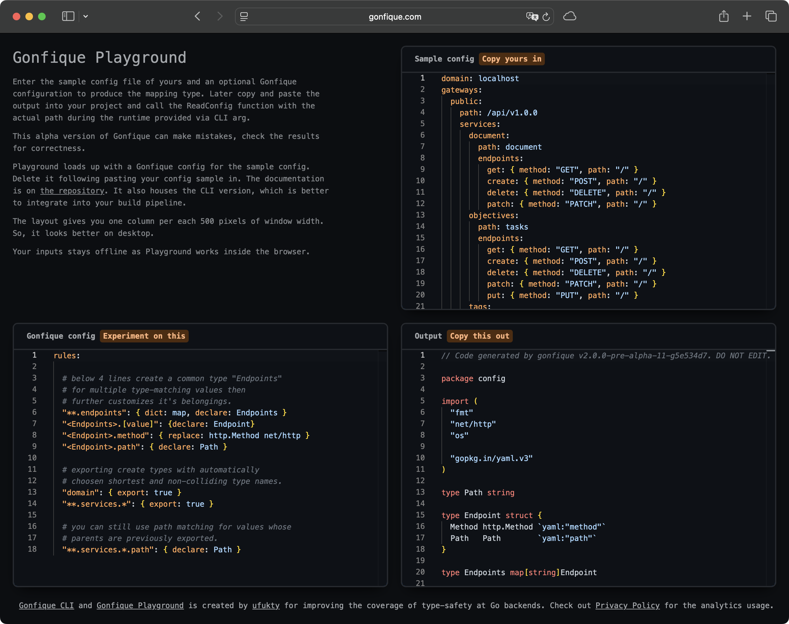

> [!IMPORTANT]  
> If you are here for Gonfique instead of Gonfique Playground; go to [Gonfique Readme](https://github.com/ufukty/gonfique).

# Gonfique Playground



Gonfique Playground brings Gonfique to your browser. 3-pane editor layout of GP offers instant response to change in input and Gonfique config.

Playground is a mainly a Node project that levarages Microsoft Monaco, TypeScript, and Golang WASM to present great user experience at maintainable development workflow.

Playground is still under development and in alpha phase. The version of Gonfique comes with Playground is under development too and in pre-alpha phase.

For the documentation of Gonfique that comes with Playground, switch to the dev branch of Gonfique repository.

## Run

Use the link in repository bio to open Gonfique Playground in browser right now. If you want to

```sh
npm run dev
```

## Build

```sh
npm run build
```

## Deploy

Gonfique Playground is deployed on a Cloudflare Worker that serves the static assets built by Vite. To publish a new version run

```sh
npm run deploy
```

This command builds the site and pushes the Worker using [Wrangler](https://developers.cloudflare.com/workers/wrangler/). The Worker handles the canonical domain redirect that previously lived in the Cloudflare Pages middleware.

## License

Shared under Apache2 license terms except for dependencies listed below. See LICENSE file for details of Apache2.

**src/public/wasm_exec.js**

Copyright 2018 The Go Authors. All rights reserved.
Use of this source code is governed by a BSD-style
license that can be found in the LICENSE file.
